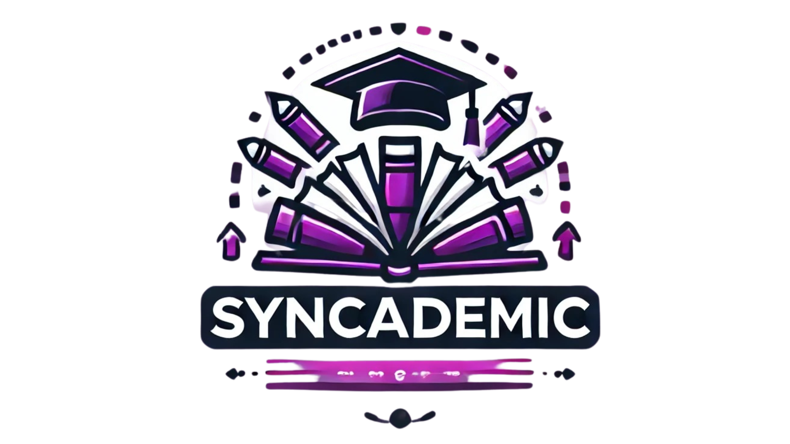
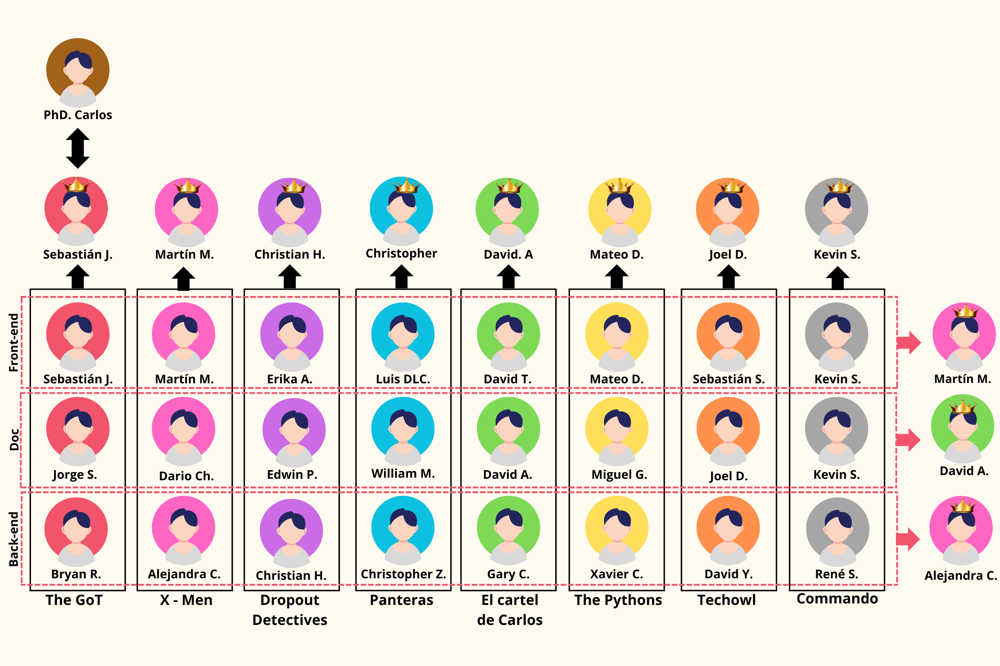

<p align="center">
  
</p>

¡Bienvenido a SYNCADEMIC! 🎓🚀

SYNCADEMIC es una innovadora aplicación web diseñada para la gestión académica, desarrollada con una robusta arquitectura de frontend y backend.

## Descripción

SYNCADEMIC es una aplicación orientada al seguimiento del rendimiendo tanto de estudiantes como de docentes permitiendo realizar actividades como:
- 🌞Identificar estudiantes que necesiten un curso de verano🌞
- 📖Identificar estudiantes con bajas calificaciones📖
- 🕥Notificar la carga horaria atrasada de un docente🕥
- 🖊️Realizar sugerencias para la planificación, tomando en consideración docentes con mayor afinidad a una asignatura🖊️
- 🏃Identificar aquellos estudiantes con posible tasa de abandono en base a su asistencia🏃
- ¡y más!

## Nuestro equipo de desarrollo
<p align="center">
  
</p>

## Tecnologías Utilizadas

### Backend
- Python 
- Django 
- Django REST Framework 
- Behave 
- Gherkin 
- Faker 
- Docker 

### Frontend
- Node.js 
- pnpm 
- Vite 
- React 
- TypeScript 
- React Bootstrap 
- ESLint 

---

## Instalación y Ejecución del Proyecto

### Requisitos Previos

1. **Node.js y pnpm**
   - Asegúrate de tener Node.js instalado. Puedes descargarlo desde [aquí](https://nodejs.org/).
   - Instala pnpm (un gestor de paquetes rápido y eficiente) globalmente:
     ```sh
     npm install -g pnpm
     ```
   - Activar pnpm (ejecutar terminal como administrador)
     ```sh
     corepack enable pnpm
     ```


2. **Python y Django**
   - Asegúrate de tener Python instalado. Puedes descargarlo desde [aquí](https://www.python.org/).
   - Instala un IDE de confianza, sugerimos Pycharm (publicidad no pagada)

### Configuración del Frontend

1. Clona el repositorio:
```sh
git clone https://github.com/tu-usuario/syncademic.git
```

2. Navega al directorio del frontend:

```sh
cd /frontend
```

3. Instala las dependencias:

```sh
pnpm install
```

4. Ejecuta el proyecto en modo de desarrollo:

```sh
pnpm run dev
```

### Configuración del Backend

1. Clona el repositorio:
```sh
git clone https://github.com/tu-usuario/syncademic.git
```

2. Navega al directorio del backend:

```sh
cd /backend
```

3. Instala las dependencias:

```sh
pip install -r requirements.txt
```

4. Realiza las migraciones:

```sh
python manage.py makemigrations
python manage.py migrate
```

5. Ejecuta el servidor:

```sh
python manage.py runserver
```

## Contribuir
¡Las contribuciones son bienvenidas! Si deseas mejorar SYNCADEMIC, por favor sigue estos pasos:

1. Haz un fork del proyecto.
2. Crea una nueva rama 
```sh
git checkout -b feature/nueva-funcionalidad
```
3. Realiza tus cambios y haz commit 
```sh
git commit -m 'feat: agrega nueva funcionalidad'
```
4. Haz push a la rama 
```sh
git push origin feature/nueva-funcionalidad
```
5. Crea un nuevo Pull Request.

## Contribuidores


---

¡Gracias por usar SYNCADEMIC! Si tienes alguna pregunta o sugerencia, no dudes en abrir un issue o contactar a los mantenedores del proyecto.